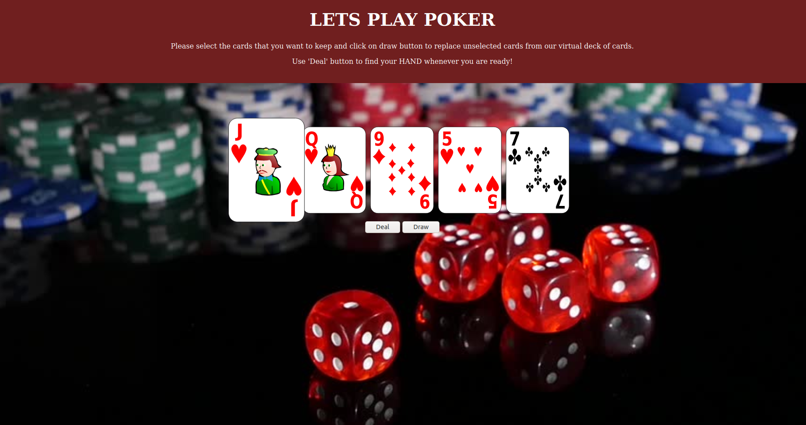
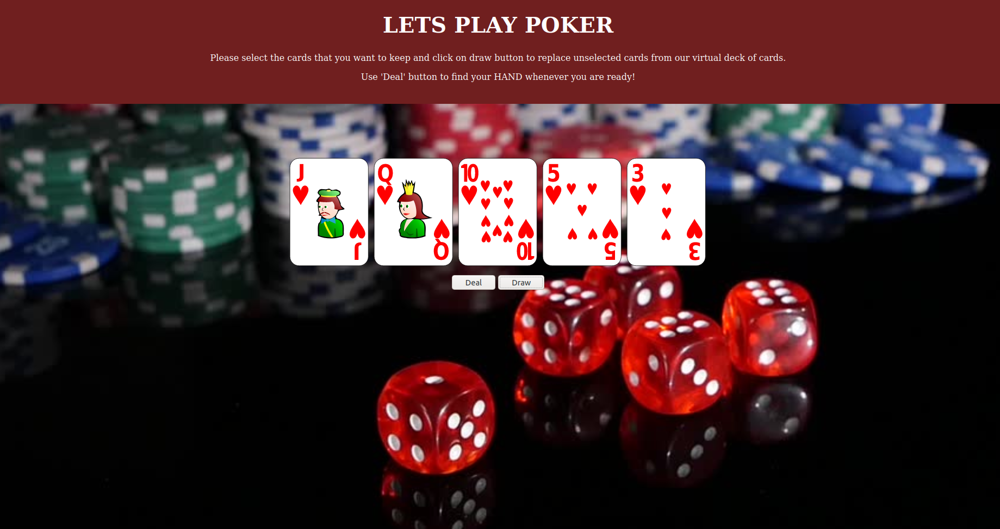
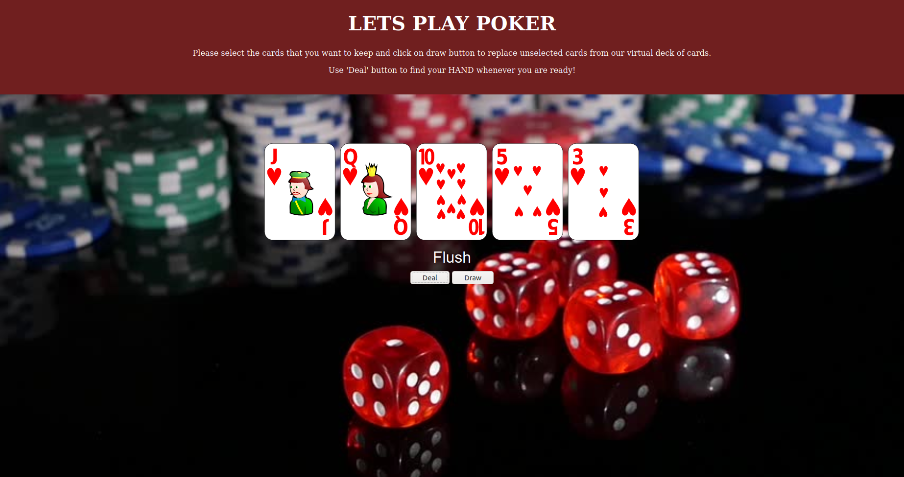

# Poker Hand Evaluation web page

### A) Get five cards (visit home page)
As the instructions on the web page suggest, we can either deal a hand with the cards we have or we can replace them except some of the good ones.

### B) Select cards
Let's keep the cards only from the suit of diamonds and replace other ones. By hovering over a card, the card rises up and floats. We can click on that card to keep it to overselves.

### C) Replace cards/ Draw cards
In the picture above, we have selected Jack of Diamonds. We will do the same for all other Diamond cards. Once we hit a draw button, all the unselected cards will get replaced by the other cards from a virtual deck of cards. We do this same until we receive all cards from the suit of Diamonds.

### D) Deal the cards
In the picture above, we have received all cards from the suit of diamonds. Once we are happy with the cards we can hit the deal button to get evaluation of the cards at our hand.

In the picture above, evaluation shows we have Flush. I hope we win in this game of poker!!
